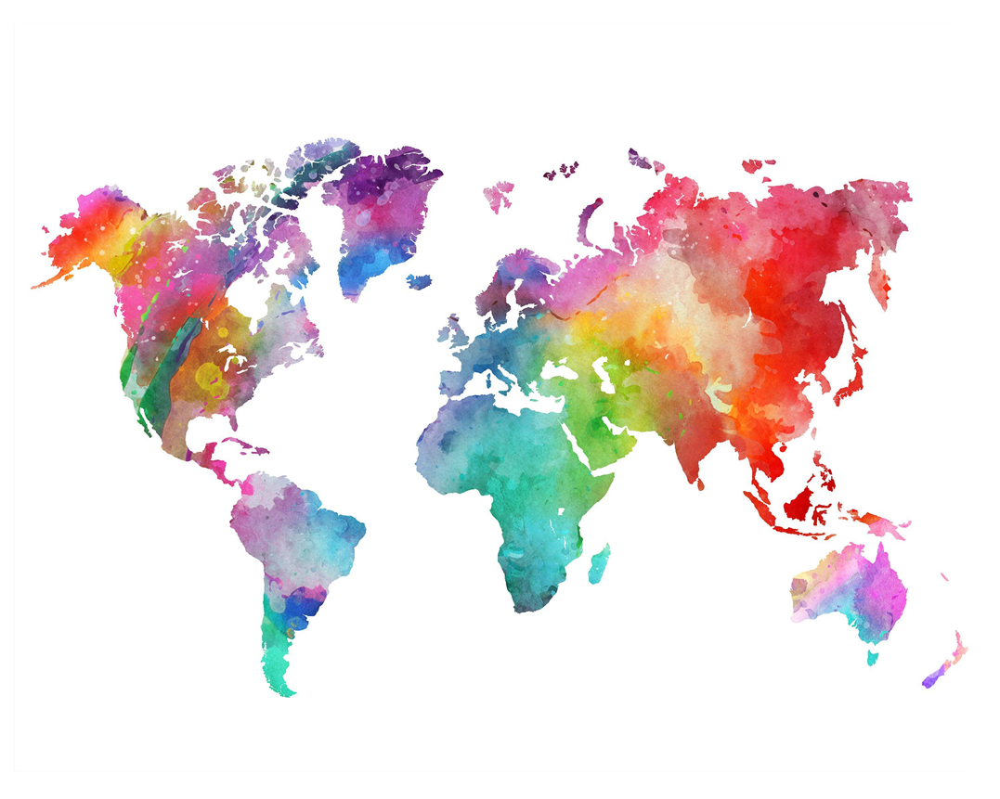
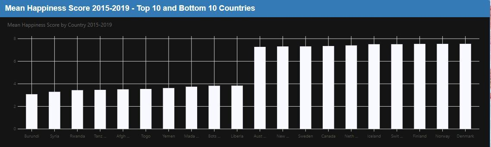
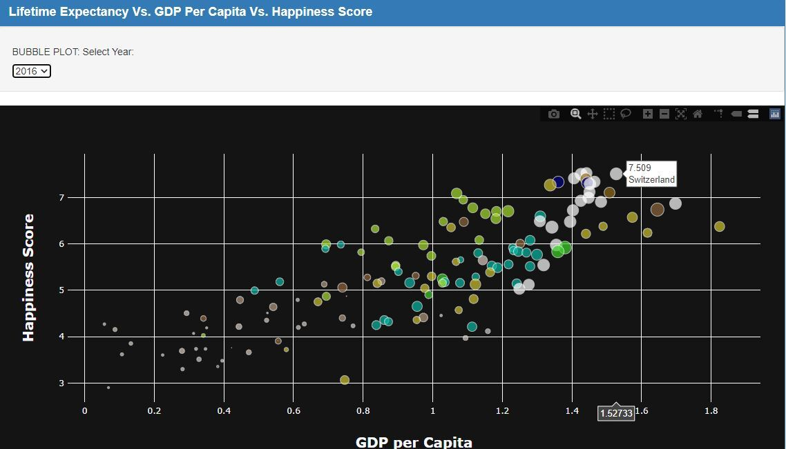
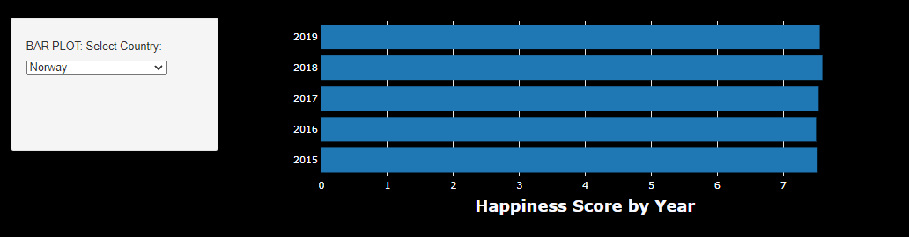
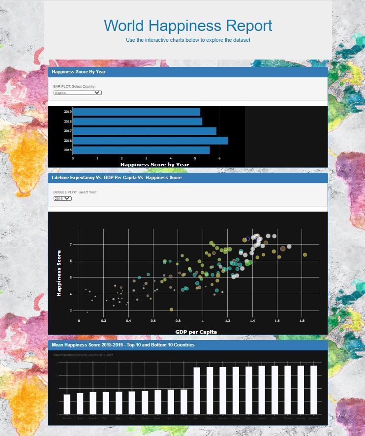

## World Happiness Report- An Analysis 

--------------------------------------------------------------------------------------------------------------------------------------------------------------------------

## Contents

* [Dataset](#dataset-header)
* [Project Outline](#project-header)
* [Presentation](#presentation-header)
* [Visualisations](#visualisation-header)
* [Dashboard](#dashboard-header)
* [Collaborators](#team-header)

--------------------------------------------------------------------------------------------------------------------------------------------------------------------------

## Dataset

For our project we have explored the [World Happiness Report Dataset](https://www.kaggle.com/unsdsn/world-happiness)\
Available from [Kaggle.com](https://www.kaggle.com). 
The report reviews the state of happiness around the world and shows how the science of happiness explains personal and national variations in happiness. The report attracts global recognition as governments and organizations often use happiness indicators in decision making.
The happiness scores found in the dataset use data from the Gallup World Poll, which provides scores based on answers to the main life evaluation question in the poll. The question reflects on the best possible life for them being a 10 on the scale, and the worst possible life being a 0. 

There are 5 CSV files in this data set: 

* [2015.csv](https://www.kaggle.com/unsdsn/world-happiness?select=2015.csv)
* [2016.csv](https://www.kaggle.com/unsdsn/world-happiness?select=2016.csv)
* [2017.csv](https://www.kaggle.com/unsdsn/world-happiness?select=2017.csv)
* [2018.csv](https://www.kaggle.com/unsdsn/world-happiness?select=2018.csv)
* [2019.csv](https://www.kaggle.com/unsdsn/world-happiness?select=2019.csv)

CSV files are placed in the Project Data folder.

--------------------------------------------------------------------------------------------------------------------------------------------------------------------------

### Data Cleaning

The first step of data processing involved renaming column headings to formalise across all five datasets. A "Year" column was added for each dataset, as well as a "Region" column in the CSV files that it was missing. The title method was used to formalise all capitalisation for “Country” and “Region” columns across all datasets so they are the same. The Lambda function was applied to assign region values by referencing an existing region column. All five csv’s were then concatenated to form one csv and any country values that did not feature in each of the five datasets were dropped. A second csv was created where our dataset was grouped by country and the mean function applied for use with one of our bar plots.

The two CSV files are located in the Project Data folder:
* global_happiness_data
* global_happiness_mean_values

--------------------------------------------------------------------------------------------------------------------------------------------------------------------------

## Project Outline

Using “The World Happiness Report” dataset, we will be analysing correlation between the GDP per capita and life expectancy contribution towards a country’s overall happiness score. We will also be exploring how happiness score ranges between different world regions, investigating any trends that may be seen. 

The dataset is in five separate csv files, which we will clean using pandas to drop irrelevant columns and rename in preparation for a database merge.
  
The database was created using PostgreSQL, In pgAdmin 4 two tables were created to hold the data and mean value data and was queryed using our Python Flask API.

The plots that have been used to represent the data are Frappe bar plot of mean happiness scores, where we will plot the top 10 countries with the highest happiness scores and the 10 countries with the lowest happiness scores. We also created a bubble plot using the plot.ly package from D3. The bubble plot was used to show lifetime expectancy and GDP contribution towards happiness scores for different countries and also the regions these countries belong to. A plot.ly bar chart was the final plot created to display our data. The chart shows the happiness scores of selected countries for years 2015, 2016, 2017, 2018 and 2019. 

--------------------------------------------------------------------------------------------------------------------------------------------------------------------------

## Presentation

The project presentation can be found in the [/Presentation](Presentation/) directory:

* happiness_report.pdf

--------------------------------------------------------------------------------------------------------------------------------------------------------------------------

## Visualisations

#### Frappe Bar Chart

For this bar chart we will use Frappe Charts a SVG Chart component with the mean happiness score data to plot 10 countries with the highest mean happiness score and 10 countries with the lowest happiness score for all five years.

#### Plotly Bubble Plot

For the bubble plot we will have

Bubble colour = Region

Size of Bubble = Life expectancy

X Values = GDP per Capita

Y Values = Happiness score

Hover Text = Country and Happiness Score

Selector = Year

#### Plotly Bar Charts

X Values = Happiness Score

Y Values = Year

Selector = Country

----------------------------------------------------------------------------------------------------------------------------

## Dashboard

----------------------------------------------------------------------------------------------------------------------------

### Task Breakdown

1. Data cleaning and processing in Pandas - Jesse
2. Database creation in SQL – Isha
3. JavaScript coding for plots – Isha, Jesse, Jessica 
4. Rendering the HTML using Flask – Jessica, Isha and Jesse 
5. Project Presentation – Jessica, Isha, Jesse
6. Readme file - Jessica

----------------------------------------------------------------------------------------------------------------------------

## Collaborators

* [Isha Singh](https://github.com/isha167)
* [Jesse Edwards](https://github.com/Squonk713)
* [Jessica Uppal](https://github.com/JessicaUppal)

